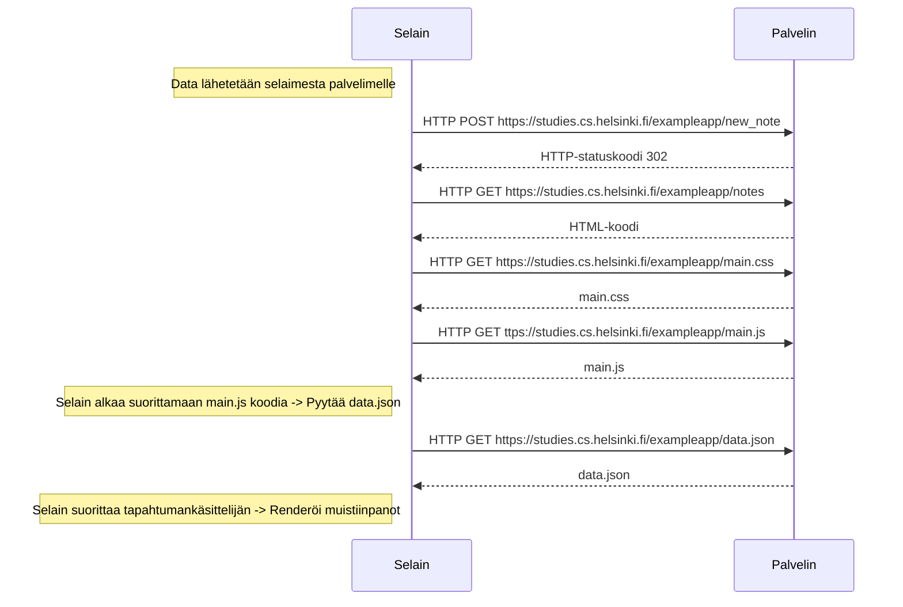

```mermaid

sequenceDiagram
    participant Selain
    participant Palvelin
    
Note left of Selain: Data lähetetään selaimesta palvelimelle

Selain->>Palvelin: HTTP POST https://studies.cs.helsinki.fi/exampleapp/new_note;

Palvelin-->>Selain: HTTP-statuskoodi 302;

Selain->>Palvelin: HTTP GET https://studies.cs.helsinki.fi/exampleapp/notes;

Palvelin-->>Selain: HTML-koodi;

Selain->>Palvelin: HTTP GET https://studies.cs.helsinki.fi/exampleapp/main.css;

Palvelin-->>Selain: main.css;

Selain->>Palvelin: HTTP GET ttps://studies.cs.helsinki.fi/exampleapp/main.js;

Palvelin-->>Selain: main.js;

Note left of Selain: Selain alkaa suorittamaan main.js koodia -> Pyytää data.json

Selain->>Palvelin: HTTP GET https://studies.cs.helsinki.fi/exampleapp/data.json;

Palvelin-->>Selain: data.json;

Note left of Selain: Selain suorittaa tapahtumankäsittelijän -> Renderöi muistiinpanot

```
