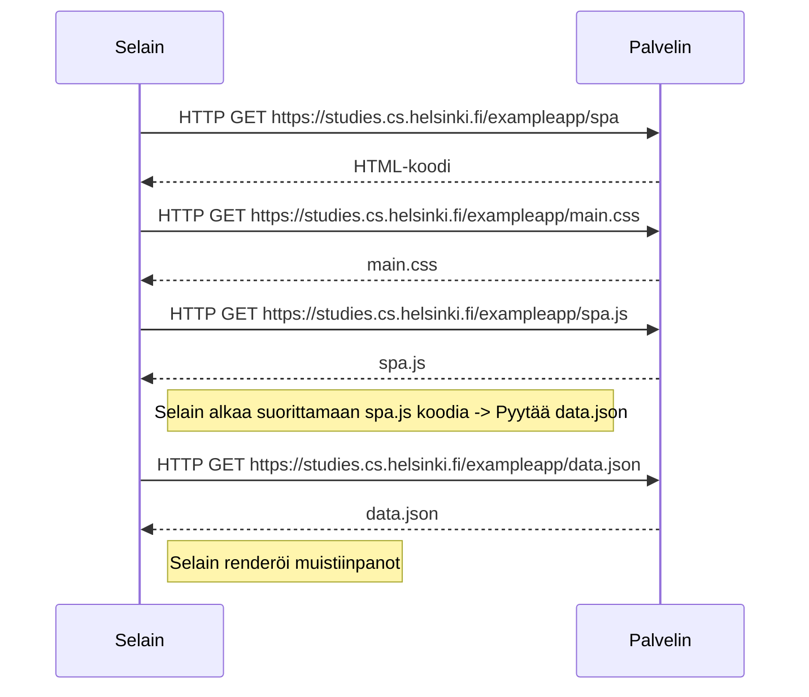

```mermaid
sequenceDiagram
    participant Selain
    participant Palvelin

Selain->>Palvelin: HTTP GET https://studies.cs.helsinki.fi/exampleapp/spa;

Palvelin-->>Selain: HTML-koodi;

Selain->>Palvelin: HTTP GET https://studies.cs.helsinki.fi/exampleapp/main.css;

Palvelin-->>Selain: main.css;

Selain->>Palvelin: HTTP GET https://studies.cs.helsinki.fi/exampleapp/spa.js;

Palvelin-->>Selain: spa.js;

Note right of Selain: Selain alkaa suorittamaan spa.js koodia -> Pyytää data.json;

Selain->>Palvelin: HTTP GET https://studies.cs.helsinki.fi/exampleapp/data.json;

Palvelin-->>Selain: data.json;

Note right of Selain:Selain renderöi muistiinpanot

```
